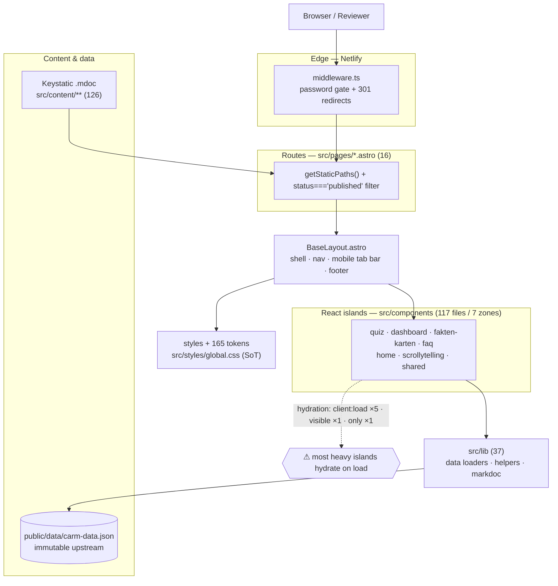

# ARCHITECTURE.md — Cannabis: Mythen & Evidenz

> One-screen orientation map for humans **and** for Claude. Use it to find what lives
> where, to point Claude at the exact files for a task, and to see what's heavy or
> duplicated. The full per-file registry (117 components, 16 routes, 165 tokens, RAG
> scorecard) lives in `_local/audit-2026-06/architecture-map.xlsx`. Read alongside
> `CLAUDE.md` (conventions + hard rules) and `DESIGN.md` (visual rationale).
>
> Generated 2026-06-16 from a read-only scan. Keep it updated as zones change shape.

---

## 1. System in brief

Evidence-based German site that debunks **42 cannabis myths** from the CaRM research
project (ISD Hamburg). Content in five formats: myth factsheets, an FAQ
("Meine Interessen"), an interactive quiz (Selbsttest), data dashboards
(Daten-Explorer), and scrollytelling.

**Stack:** Astro 6 SSR (`output: "server"`) on Netlify with edge middleware · React 18
islands · Keystatic 5 (Markdoc `.mdoc`) Git-based CMS · ECharts 5 + D3 7 for viz ·
plain CSS with **165 design tokens** · TypeScript strict. No Tailwind, no test runner;
`astro check` is the only gate.

---

## 2. Domain glossary (read first)

| Term | Means |
|---|---|
| **4-level classification** | Every myth resolves to `richtig · eher_richtig · eher_falsch · falsch` (+ `keine_aussage`). **Never** collapse to true/false. |
| **Zielgruppe** | One of 5 CaRM data slices: Volljährige (18–70), Minderjährige (16–17), Konsumierende, Junge Erwachsene (18–26), Eltern. Dashboards switch view by Zielgruppe. |
| **Schritte** | Quiz scoring unit. ALL quiz math goes through `schritte()` → `pointsForSchritte()` → `moduleScore()` → `scoreBand()` in `quizData.ts`. Never binary. |
| **CaRM** | ISD Hamburg population survey (n≈2 097). Frame as "Erwachsene (18–70) in einer Bevölkerungsbefragung in Deutschland". Never say "repräsentativ". |
| **Daten-Explorer** | Public URL `/daten-explorer/`. Content folder is still `src/content/zahlen-und-fakten/` (only the URL moved — Stage 5). |
| **Meine Interessen** | The FAQ. URL `/meine-interessen/`, content in `src/content/faq/`. |
| **Über das Projekt** | URL `/projekt/` (content singleton still `ueber-uns-scrolly.yaml`). |
| **Du/Sie** | Voice is **Du** site-wide, except Meine Interessen for Eltern/Fachkräfte/Lehrkräfte (Sie). |

---

## 3. Layer diagram



A request hits the **edge middleware** first (auth + redirects), then an **Astro page**
(SSR, published-only), wrapped in the single **BaseLayout**, which mounts **React
islands**. Islands read data through **`src/lib`** from **`carm-data.json`** or
**Keystatic `.mdoc`**. Styling is plain CSS driven by **tokens in `global.css`**.

---

## 4. Layers — where things live

| Layer | Path | What |
|---|---|---|
| Edge | `src/middleware.ts` | Password gate + all 301 redirects (runs before pages) |
| Routes | `src/pages/**/*.astro` | One file per URL; `getStaticPaths` + published filter |
| Layout | `src/layouts/BaseLayout.astro` | The only layout: shell, nav, footer, mobile tab bar |
| Islands | `src/components/<zone>/` | Interactive React (7 zones) |
| Lib | `src/lib/` | Data loaders (`dashboard/data.ts`), helpers (`content.ts`, `faq.ts`), markdoc |
| Content | `src/content/**` (Keystatic) | Myths, quiz text, FAQ, scrollytelling — editorial SoT |
| Data | `public/data/carm-data.json` | Pre-processed survey dataset (immutable) |
| Styles | `src/styles/*.css` | `global.css` = tokens + base; per-area `dashboard.css`, `quiz.css`, … |

CSS sizes (health): `dashboard.css` 8 546 🔴 · `quiz.css` 6 103 🔴 · `scrollytelling.css`
3 829 🔴 · `global.css` 3 335 🟡 · others <800 🟢.

---

## 5. Zone maps

> Per-file metrics for every zone are in `architecture-map.xlsx` sheet "02 · Components".

### 5.1 Daten-Explorer (dashboard) — biggest & heaviest zone 🔴
- **Route:** `/daten-explorer/` · `/daten-explorer/daten/[slug]`
- **Entry page:** `src/pages/daten-explorer/index.astro` → `MythenExplorer` (`client:load`)
- **Island:** `src/components/dashboard/MythenExplorer.tsx` (1 073 LOC, 42 hooks, **41 imports** — god-component)
- **Views (copy-paste pairs ⚠):** `views/StripsView` ↔ `SourcesStripsView`, `SpannweiteView` ↔ `SourcesSpannweiteView`, `TableView` ↔ `SourcesTableView`, `BalkenView` ↔ `SourcesBalkenView`; plus `ScatterView`, `LollipopView`, `CircularView`, `HoverTooltip`, `DetailPanel`
- **Controls/grid:** `controls/*`, `grid/*`, `FilterBar`, `ViewTabs`, `ExportDrawer`, `FilterDrawer`
- **Lib:** `src/lib/dashboard/{data,types,colors,translations,url-state,export}.ts`
- **Data:** `public/data/carm-data.json` (+ `information-sources.json`, fetched in 3 places ⚠)
- **Styles:** `src/styles/dashboard.css` (8 546 LOC)
- **Danger zones:** `carm-data.json` is immutable; the floating pill nav; ECharts ships on `client:load`. **Mobile = Hard** (fixed-width charts, hover-only tooltips, wide tables).

### 5.2 Quiz (Selbsttest) 🔴
- **Route:** `/quiz/` · `/quiz/[slug]`
- **Entry page:** `src/pages/quiz/[slug].astro` — the **join point** (forwards both stores). `QuizPlayer` is `client:only` (no SSR; `<noscript>` missing).
- **Island:** `src/components/quiz/QuizPlayer.tsx` (1 020 LOC, 43 hooks)
- **Two sources of truth:** editorial text → `src/content/quiz/*.mdoc`; data + scoring → `src/components/quiz/quizData.ts` (`mythId`, `correctClassification`, `populationCorrectPct`, all Schritte math)
- **Support:** `i18n.ts` (UI labels), `matomo.ts` (events), `StreakChip.tsx`, share-card / ResultScreen (inline in player)
- **Styles:** `src/styles/quiz.css` (6 103 LOC) · **Persistence:** `localStorage cm-quiz-score-{slug}`
- **Danger zones:** never edit scoring fields outside review; a new Keystatic field is dropped unless `[slug].astro` forwards it. **Mobile = Medium.**

### 5.3 Fakten-Karten 🟡
- **Route:** `/fakten-karten/` · JSON endpoint `fakten-karten/factsheets/[mythNumber].json.ts`
- **Entry page:** `src/pages/fakten-karten/index.astro` → `FaktenKartenExplorer` (`client:load`)
- **Components:** `FaktenKartenExplorer`, `FaktenCard`, `FaktenFilterBar` (606 LOC), `CategoryFooter`
- **Content:** the 42 myths in `src/content/zahlen-und-fakten/mNN-*.mdoc`
- **Styles:** `src/styles/fakten-karten.css` (564 LOC 🟢)
- **Danger zones:** factsheet JSON is **public even behind the password gate** (see audit). **Mobile = Medium.**

### 5.4 Meine Interessen (FAQ) 🟡
- **Route:** `/meine-interessen/` · `/meine-interessen/[slug]` · `/meine-interessen/frage/[question]`
- **Entry pages:** `src/pages/meine-interessen/*.astro`
- **Components:** `MeineInteressenLayout.astro` (727 LOC), `MeineInteressenAudience.astro`, `MythPopupHost` (pre-loads all 42 myths — `client:load`), `FaqVerdictPill`, `AudienceHeader`, `HelplineBox`, `WeiterfuehrendList`
- **Content:** `src/content/faq/` (audiences + questions) · **Lib:** `src/lib/faq.ts` (664 LOC)
- **Danger zones:** Sie-form pockets for Eltern/Fachkräfte/Lehrkräfte only. **Mobile = Medium.**

### 5.5 Home 🟢
- **Route:** `/` (`src/pages/index.astro`)
- **Components:** `hero/HeroBlock` (`client:load`) + `home/` blocks: `CredibilityBlock`, `HeadlineFindingBlock`, `QuizHookBlock`, `previews/*`, `ProjektTeaserBlock`, `ProjectStripBlock`
- **Content:** singletons `*-block.yaml` (hero, credibility, headline-finding, quiz-hook)
- **Danger zones:** credibility lede has a sanctioned population-framing exception (CLAUDE.md). **Mobile = Easy.**

### 5.6 Scrollytelling 🟡
- **Route:** `/projekt/` · `/startseite/[slug]`
- **Entry pages:** `src/pages/projekt/index.astro`, `startseite/[slug].astro` → `ScrollytellingViewer` (`client:load` / `visible`)
- **Components:** `scrollytelling/Viz*` (e.g., `VizSampleAndRanked` 817, `VizSourcesStrips`, `VizPeopleVoices`, `VizMythGrid`, `VizTimeline`)
- **Styles:** `src/styles/scrollytelling.css` (3 829 LOC)
- **Danger zones:** D3 viz components are large; **Mobile = Hard** (sticky viz band collapses only at 1023px).

### 5.7 Shared 🟡
- `src/components/shared/`: `FactsheetPanel.tsx` (679 LOC), `BalkenAxis`, `ValueCircle`
- Used across dashboard + fakten-karten + faq.

---

## 6. Vertical slices (route → files)

```
/quiz/[slug]      → pages/quiz/[slug].astro → QuizPlayer.tsx
                     ├ data:    quizData.ts        ├ content: content/quiz/*.mdoc   └ styles: quiz.css
/daten-explorer/  → pages/daten-explorer/index.astro → MythenExplorer.tsx
                     ├ data:    carm-data.json (+ information-sources.json)
                     ├ lib:     lib/dashboard/{data,url-state,colors,export}.ts     └ styles: dashboard.css
/fakten-karten/   → pages/fakten-karten/index.astro → FaktenKartenExplorer.tsx
                     ├ content: content/zahlen-und-fakten/*.mdoc                     └ styles: fakten-karten.css
/meine-interessen/→ pages/meine-interessen/index.astro → MeineInteressenLayout.astro + MythPopupHost
                     ├ content: content/faq/**          ├ lib: faq.ts               └ styles: (global + faq)
```

---

## 7. How to brief Claude with this map

Aider "repo map" principle: give Claude **only the files for the task** — extra files
distract the model and cause edits in the wrong place.

1. Find the zone in §5 → copy the exact file paths.
2. Name those files in the prompt and **forbid touching others** (templates A–G in
   `_local/audit-2026-06/03-claude-playbook.md`).
3. Paste the relevant **Danger zones** line so Claude knows what not to break.

Example: _"Work only on the Quiz zone. Edit `src/styles/quiz.css` only. Do not touch
`quizData.ts` (scoring) or other zones. Show the plan first, wait for go."_

---

## 8. Danger zones (cross-cutting — full list in CLAUDE.md "Never modify without asking")
`public/data/carm-data.json` · `quizData.ts` integrity fields · myth `mythId/mythNumber`
· `keystatic.config.ts` · `.npmrc` · `netlify.toml` + `middleware.ts` · the floating pill
nav (`.nav*`, `main { padding-top }`) in `global.css` / `BaseLayout.astro`.

## 9. Keeping it updated
Update the zone block (§5) + the matching Excel row when a zone's files change shape
(new island, moved data, renamed route). Treat like the C4 model: version-controlled,
updated as the system evolves. Re-run the scan in `_local/audit-2026-06/` to refresh metrics.
